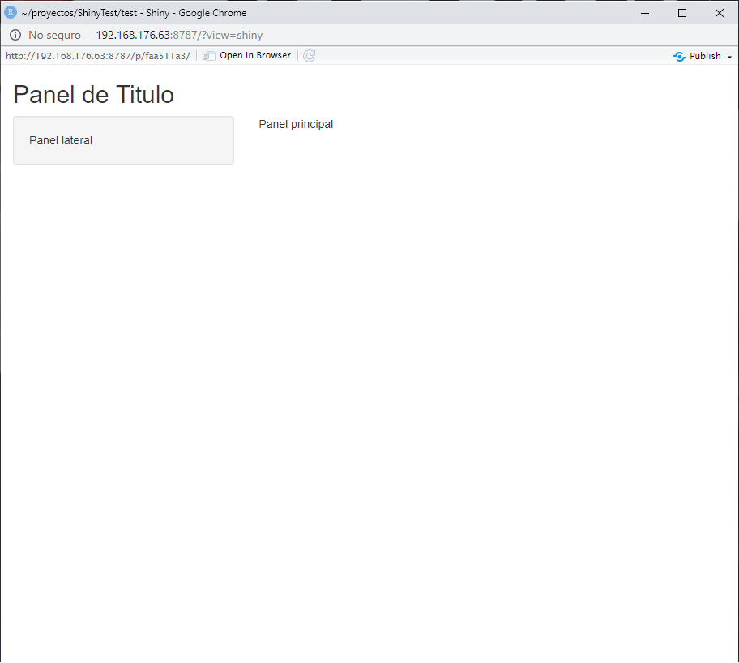

# Interfase de Usuario: Como construirla

Ahora que ya entiende la estructura de una Shiny app, es tiempo de construir la primera desde cero.


## Objetivos

- Crear una Shiny app desde cero
- Entender los principio básico del diseño de la aplicación.

En este capítulo vamos a ver como contruir una interfase de usuario para la aplicación. Aprenderá como diseñar la interfase, para luego agregar texto, imágenes y otros elementos HTML.

## Manos a la obra

Usaremos la app `MiAplicacion` del capítulo anterior. Para comenzar abra el archivo `app.R` y modifique el código para que se vea de la siguiente forma:

```
library(shiny)

# En esta sección se define la interfase de usuario y es donde haremos la mayor parte del trabajo
ui <- fluidPage(
                )

# Se define la lógica que sigue el servidor
server <- function(input, output) {
                                  }

# Ejecuta la aplición
shinyApp(ui = ui, server = server)
```

Esto código representa el mínimo posible necesario para create un Shiny app. El resultado es bastante poco util, es una aplicación vacís, sin contenido, con un espacio blanco donde debería estar la interfase de usuario y las salidas como tablas o gráficos. Es por esto que es un excelente punto de partida para el trabajo que vamos a realizar en este capítulo.

### Diseño (Layout)

Shiny usa la función `fluidPage` para crear el display que se ajusta automáticamente las dimenciones de la ventana del navegador del usuario.  Es en esta función donde se introducen los elemento necesarios para diseñar la interfase de usuario.

Por ejemplo, la función `ui` que se ve abajo, crea una interfase de usuario que tiene un panel con un título (`titlePanel`) y un diseño de barra lateral (`sidebarLayout`); incluye un panel lateral (`sidebarPanel`) y un panel principal (`mainPanel`). Hay que hacer notal que estos elemento son incluidos **dentro** de la función `fluidPage`.

```
ui <- fluidPage(
  titlePanel("Panel de Título"),
  sidebarLayout(
        sidebarPanel("Panel lateral"),
        mainPanel("Panel principal")
               )
  )
```
La Shiny app creada con esta intefase de usuario resultante se puede ver la Figura 2.1.




`titlePanel` y `sidebarLayout` son dos de los elemento mas populares para agregar a `fluidPage`^[Recuerde que esta es la función que crea el espacio de la UI que se ajusta al tamaño del navegados del usuario.]. Esto crea ela Shiny app básica con una barra lateral.

`sidebarLayout` siempre usa dos argumentos:

- Función `sidebarPanel` que define el espacio para la barra lateral.
- Función `mainPanel` que define el espacio del panel principal. 

La barra lateral aparecerá por defecto en el lago izquierdo de la aplicación. Esta se puede move al lado derecho agregando a la función `sidebarLayout` el argumento `position = "right"`. Este código se puede ver a continuación y el resultado en la Figura 2.2.

```
ui <- fluidPage(
  titlePanel("Panel de Título"),
   sidebarLayout(
        position = "right",
        sidebarPanel("Panel lateral"),
        mainPanel("Panel principal")
               )
  )
```


`titlePanel` y `sidebarLayout` crea un diseño básico para la Shiny app, pero además se puede crear un diseño más avanzado. 
Para esto es posible usar `navbarPage` para crear en la app una interfase de usuarios multi-páginas que incluye una barra 
de navegación. Otra opción es usar `fluidRow` y `column` para construir un diseño basado en un sistema de grillas. 

Si ud. quiere aprender mas sobre estas opciones avanzadas, puede encontrar la informacion en en la guía [Shiny Application] Layout(https://shiny.rstudio.com/articles/layout-guide.html). En este libro usaremos `sidebarLayout`.

## Contenidos HTML

En una Shiny app se puede incluir contenido agregandolo dentro de la **función del panel**. Por ejemplo, las app anteriores
despliegan una cadena de caracteres en cada uno de sus paneles. Las palabras *panel lateral* aparecen en la barra lateral, porque fueron agregados como una cadena de caracters a la función `sidebarPanel`, e.g. `sidebarPanel("Panel lateral")`. Lo mismo es verdadero para el texto en el *panel de título* y en el *panel principal*.

Para agregar contenido mas avanzado se debe usar alguna de las fuciones de identificación HTML que usar Shiny. Estas funciones son paralelas a a identificadores (*tags*) de HTML5. Aqui hay una lista de los principalaes para que los pruebe.

| Función en Shiny	| Equivalente HTML5 | Crea |
| - | - | - |
| `p` |`<pre>`| Párrafo de texto |
| `h1`	| `<h1>` | Título de primer orden |
| `h2`	| `<h2>`	| Título de segundo orden |
| `h3`	| `<h3>`	| Título de tercer orden |
| `h4`	| `<h4>`	| Título de cuarto orden |
| `h5`	| `<h5>`	| Título de quinto orden |
| `h6`	| `<h6>`	| Título de sexto orden |
| `a`	| `<a>`	| Hipervínculo |
| `br`	| `<br>`	| Línea |
| `div`	| `<div>`	| División en el texto con estilo uniforme |
| `span`	| `<span>`	| Una división en linea del texto con estilo uniforme |
| `pre`	| `<pre>`	| Texto 'como es' en una fuente de ancho fijo |
| `code`	| `<code>`	| Bloque de código formateado |
| `img`	| ``	| Una imagen |
| `strong`	| `<strong>`	| Texto en negrita |
| `em`	| `<em>`	| Texto en cursiva |
| `HTML`	|  	| Pasa una cadena de caracteres como código HTML |


