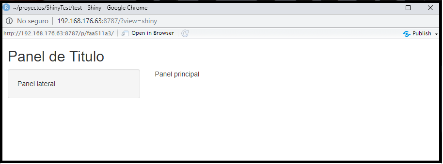
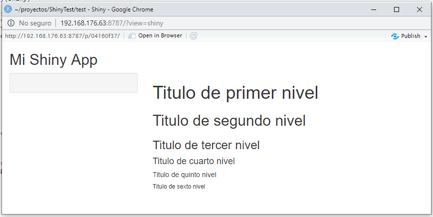
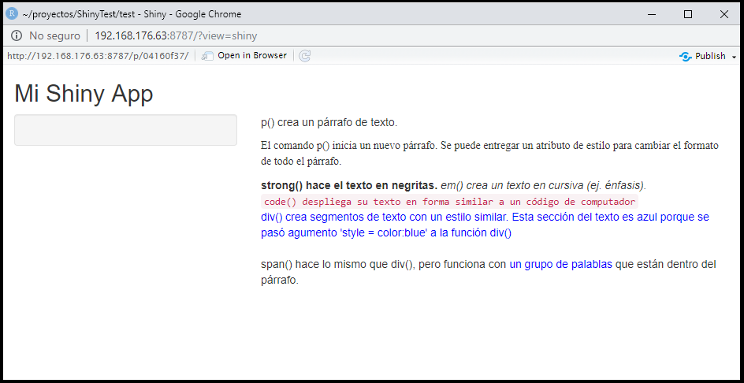
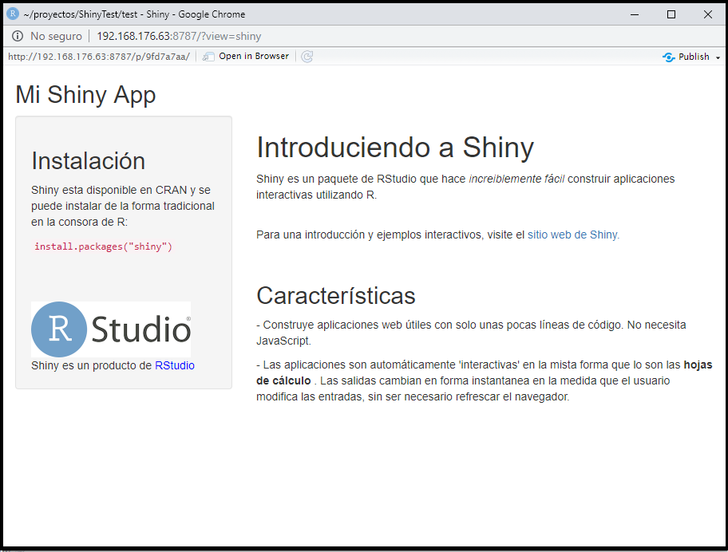

# Interfase de Usuario: Como construirla

Ahora que ya entendemos como funciona la estructura de una aplicación Shiny, es tiempo de construir la primera desde cero.

## Objetivos

- Crear una Shiny app desde cero.
- Entender los principios básicos del diseño de la aplicación.
- Aprender y utilizar las diferentes opciones para el formato de texto.
- Incluir imágenes en la interfase de usuario.

En este capítulo vamos a ver como construir una interfase de usuario para la aplicación. Aprenderá como diseñar la 
interfase, para luego agregar texto, imágenes y otros elementos HTML.

## Manos a la obra

Usaremos la app `MiAplicacion` del capítulo anterior. Para comenzar abra el archivo `app.R` y modifique el código
para que se vea de la siguiente forma:

```
library(shiny)

# En esta sección se define la interfase de usuario y es donde haremos la mayor parte del trabajo
ui <- fluidPage(
                )

# Se define la lógica que sigue el servidor
server <- function(input, output) {
                                  }

# Ejecuta la aplición
shinyApp(ui = ui, server = server)
```

Este código representa el mínimo posible necesario para crear un Shiny app. El resultado es bastante poco útil, 
es una aplicación vacía, sin contenido, con un espacio en blanco donde debería estar la interfase de usuario y las
salidas como tablas o gráficos. Es por esto que es un excelente punto de partida para el trabajo que vamos a 
realizar en este capítulo.

### Diseño (Layout)

Shiny usa la función `fluidPage` para crear el espacio que se ajusta automáticamente a las dimensiones de la ventana
del navegador del usuario. Es en esta función donde se introducen los elementos necesarios para diseñar la interfase
de usuario.

Por ejemplo, la función `ui` que se ve abajo, crea una interfase de usuario que tiene un panel con un título 
(`titlePanel`) y un diseño de barra lateral (`sidebarLayout`); incluye un panel lateral (`sidebarPanel`) y un panel
principal (`mainPanel`). Hay que hacer notar que estos elementos son incluidos **dentro** de la función `fluidPage`.

```
ui <- fluidPage(
  titlePanel("Panel de Título"),
  sidebarLayout(
        sidebarPanel("Panel lateral"),
        mainPanel("Panel principal")
               )
  )
```
La Shiny app creada con esta interfase de usuario resultante se puede ver la Figura \@ref(fig:shinyBlank).

```{r shinyBlank, echo=FALSE, out.width = '100%', fig.align = 'center', fig.cap = 'Interfase de Usuario (UI) limpia y sin contenido..'}

```

`titlePanel` y `sidebarLayout` son dos de los elemento más populares para agregar a `fluidPage`^[Recuerde que esta es la función que crea el espacio de la UI que se ajusta al tamaño del navegador del usuario.]. Esto crea la Shiny app básica con una barra lateral.

`sidebarLayout` siempre usa dos argumentos:

- Función `sidebarPanel` que define el espacio para la barra lateral.
- Función `mainPanel` que define el espacio del panel principal. 

La barra lateral aparecerá por defecto en el lado izquierdo de la aplicación. Esta se puede mover al lado derecho 
agregando a la función `sidebarLayout` el argumento `position = "right"`. Este código se puede ver a continuación 
y el resultado en la Figura \@ref(fig:shinyRight).

```
ui <- fluidPage(
  titlePanel("Panel de Título"),
   sidebarLayout(
        position = "right",
        sidebarPanel("Panel lateral"),
        mainPanel("Panel principal")
               )
  )
```

```{r shinyRight, echo=FALSE, out.width = '100%', fig.align = 'center', fig.cap = 'Interfase de Usuario (UI) limpia y sin contenido, con la barra lateral a la derecha, usando el argumento `position = "right"`.'}
knitr::include_graphics("imagenes/3.2_Shiny_ClearRight.png")
```

`titlePanel` y `sidebarLayout` crea un diseño básico para la Shiny app, sin embargo es posible crear un diseño más avanzado. 
Para esto se puede usar `navbarPage` con la cual se crea en la app una interfase de usuarios multi-páginas que incluye una barra 
de navegación. Otra opción es usar `fluidRow` y `column` para construir un diseño basado en un sistema de grillas. 

Si ud. quiere aprender más sobre estas opciones avanzadas, puede encontrar la información en en la guía 
[Shiny Application Layout](https://shiny.rstudio.com/articles/layout-guide.html). En esta clase introductoria sólo 
usaremos `sidebarLayout`.

### Contenidos HTML

En una Shiny app es posible agregar contenido incluyéndolo en la **función del panel**. Por ejemplo, en las app que 
hemos visto hasta ahora, se despliega una "cadena de caracteres" en cada uno de sus paneles. Las palabras *panel lateral*
aparecen en la barra lateral y fueron agregados como una cadena de caracteres a la función `sidebarPanel`, e.j.
`sidebarPanel("Panel lateral")`. Lo mismo es verdadero para el texto en el *panel de título* y en el *panel principal*.

Para agregar contenido más avanzado se debe usar alguna de las funciones de identificación HTML que usa Shiny. Estas
funciones son aquivalentes a los identificadores (*tags*) de HTML5. Aquí hay una lista de los principales para que los pruebe.

| Función en Shiny	| Equivalente HTML5 | Crea |
| - | - | - |
| `p` |`<pre>`| Párrafo de texto |
| `h1`	| `<h1>` | Título de primer orden |
| `h2`	| `<h2>`	| Título de segundo orden |
| `h3`	| `<h3>`	| Título de tercer orden |
| `h4`	| `<h4>`	| Título de cuarto orden |
| `h5`	| `<h5>`	| Título de quinto orden |
| `h6`	| `<h6>`	| Título de sexto orden |
| `a`	| `<a>`	| Hipervínculo |
| `br`	| `<br>`	| Línea |
| `div`	| `<div>`	| División en el texto con estilo uniforme |
| `span`	| `<span>`	| Una división en linea del texto con estilo uniforme |
| `pre`	| `<pre>`	| Texto 'como es' en una fuente de ancho fijo |
| `code`	| `<code>`	| Bloque de código formateado |
| `img`	| ``	| Una imagen |
| `strong`	| `<strong>`	| Texto en negrita |
| `em`	| `<em>`	| Texto en cursiva |
| `HTML`	|  	| Pasa una cadena de caracteres como código HTML |


### Títulos

Para crear un título:

- Seleccione una función de título (ej: h1 a h5).
- Ingrese el texto que quiere desplegar como título.

Por ejemplo, cree un título de primer nivel que diga “Mi título” con `h1("Mi título")`. Si se ejecuta este comando en la 
línea de comandos, puede ver que produce un código HTML.

```
> library(shiny)
> h1("Mi titulo")

<h1>Mi titulo</h1>
```

Para agregar un elemento a tu app:

- Pase `h1("My title")` como un agumento a `titlePanel`, `sidebarPanel` o `mainPanel`.
El texto aparecerá en el panel correspondiente de su página web. Usted aquí puede agregar elementos en el mismo panel,
para esto solo tiene que separarlos con una coma (**,**).

Practiquemos. El siguiente código usa todos los 6 nivel de títulos existentes. Actualice su _ui.R_ o _app.R_ para que produzca 
resultados similares y reinicie la aplicación. Recuerde que es necesario reiniciar la Shiny app y eso se puede hacer con 
`runApp("MiAplicacion")`, haciendo click en el botón *Run App*, o usando las cambinaciones de teclas. 

Actualice ahora el código para usar los 6 niveles de títulos disponibles. Actualice el archivo _ui.R_ o _app.R_ para que sea similar 
al que se presenta a continuación. Recuerde reiniciar la Shiny app.

```
ui <- fluidPage(
  titlePanel("Mi Shiny App"),
  sidebarLayout(
    sidebarPanel(),
    mainPanel(
      h1("Titulo de primer nivel"),
      h2("Titulo de segundo nivel"),
      h3("Titulo de tercer nivel"),
      h4("Titulo de cuarto nivel"),
      h5("Titulo de quinto nivel"),
      h6("Titulo de sexto nivel")
    )
  )
)
```
> **Atención**: En algunos casos, el incluir texto con tildes dentro de una Shiny app puede causar problemas con la forma en que se 
> codifica el texto. Si le genera errores, trate removiendo los tildes.

La Sihny app resultante debería ser similar a lo que se presenta en la figura \@ref(fig:shinyTitulos).

```{r shinyTitulos, echo=FALSE, out.width = '100%', fig.align = 'center', fig.cap = 'Interfase de Usuario (UI) utilizando los 6 niveles de títulos (h1 a h6).'}

```

Los títulos pueden ser alineados utilizando el argumento `align`. En general, casi todos los atributos de identificadores 
HTML pueden ser usados como argumentos en una función de identificacion (tag) de Shiny.

Si ud. no tiene familiaridad con los atributos de los identificadores HTML, puede verlos en algunos de los innumerables
recursos que existen en la red, por ejemplo [w3schools](http://www.w3schools.com/tags/tag_hn.asp){target=_-_new}.

### Texto con formato

Shiny ofrece muchas funciones identificadoras para darle formato al texto. La forma más simple de enseñarlas es usando 
un ejemplo. 

Copie el objeto `ui` en su archivo `ui.R` o `app.R` y guárdelo. Si su Shiny app aun está corriendo, puede refrescar la página 
web y debería mostrar los cambios. 

``` 
ui <- fluidPage(
    titlePanel("Mi Shiny App"),
    sidebarLayout(
        sidebarPanel(),
        mainPanel(
            p("p() crea un párrafo de texto."),
            p("El comando p() inicia un nuevo párrafo. Se puede entregar un atributo de estilo para cambiar el formato 
              de todo el párrafo.", style = "font-family: 'times'; font-si16pt"),
            strong("strong() hace el texto en negritas."),
            em("em() crea un texto en cursiva (ej. énfasis)."),
            br(),
            code("code() despliega su texto en forma similar a un código de computador"),
            div("div() crea segmentos de texto con un estilo similar. Esta sección del texto es azul porque se pasó 
                agumento 'style = color:blue' a la función div()", style = "color:blue"),
            br(),
            p("span() hace lo mismo que div(), pero funciona con",
              span("un grupo de palablas", style = "color:blue"),
              "que están dentro del párrafo.")
        )
    )
)
```

La Shiny app resultate con esta ui se puede ver en la figura \@ref(fig:shinyFormato).

```{r shinyFormato, echo=FALSE, out.width = '100%', fig.align = 'center', fig.cap = 'Interfase de Usuario (UI) donde se muestran ejemplos de como formatear texto.'}

```

### Imágenes

Incluir imágenes en una plicación Shiny ayuda a mejorar significativamente la apariencia y permite a los usuarios 
a entender mejor el contenido. En Shiny se pueden agregar imágenes utilizando la función `img`.

Para incluir una imagen usando la función `img()` se debe incluir en el argumento src el path y el nombre del archivo
utilizando comillas (ej. img(src = "Path/a/mi/Imagen.png")). Esto también se puede hacer utilizando un _url_ si la imagen esta
dispoble en una página web. La función también acepta identificadores HTML como alto (_height_) y ancho (_width_), con 
los números representado a píxeles.

```
## Utilizando una imagen local
img(src = "my_image.png", height = 72, width = 72) 

## Utilizando una imagen en un servidor web
img(src = "https://www.ifop.cl/wp-content/contenidos/uploads/Logo_ifop.jpg")
```

La función `img` busca la imagen en un lugar específico, los archivos de imágenes locales deben estar contenidos en el directorio
_www_ que debe estar en el mismo directorio que el archivo app.R o ui.R. Shiny comparte todos los archivos en el directorio _www_ 
con el navegador del usuario, haciendo esto el lugar perfecto para poner imágenes, hojas de estilo y otras cosas que el 
navegador necesite para contruir los componentes web de la aplicación Shiny.

Un código de ejemplo con una imagen local y otra remota se muestra a continuación. Baje el archivo rstudio.png desde
[[aquí]{https://shiny.rstudio.com/tutorial/written-tutorial/lesson2/www/rstudio.png}], déjelo en el directorio _www_ y úselo. 
La imagen remota no necesita ningún proceso o cambio para que la pueda utilizar. 

> Por favor note que entre las 2 funciones img() existe una coma, esta es necesaria, de otra forma R lo interpreta como solo
> una función y generará un error.

```
ui <- fluidPage(
  titlePanel("Mi Shiny App"),
  sidebarLayout(
    sidebarPanel(),
    mainPanel(
      img(src = "rstudio.png", height = 140, width = 400), 
      img(src = "https://www.ifop.cl/wp-content/contenidos/uploads/Logo_ifop.jpg")
    )
  )
)
```

```{r shinyImg, echo=FALSE, out.width = '100%', fig.align = 'center', fig.cap = 'Interfase de Usuario (UI) con una imgaen local en directorio _www_ y una remota en un servidor web.'}
knitr::include_graphics("imagenes/3.5_Shiny_Img.png")
```

### Otros Identificadores (tags) de funciones

En este capítulo cubrimos los identificadores de funciones Shiny más comunes y usados, pero existen muchos otros que pueden
ser utilizados. Puede aprender sobre estos otros identificadores de funciones en 
[Customize your UI with HTML](https://shiny.rstudio.com/articles/html-tags.html){target=_new} y en 
[Shiny HTML Tags Glosay](https://shiny.rstudio.com/articles/tag-glossary.html){target=_new}.

## Actividad

Cree una aplicación Shiny utilizando lo que ha aprendido sobre el diseño de los paneles, HTML y funciones de imagen para 
crear una interfase de uruario atractiva. Vea cuan bien entiende estas funciones recreando la aplicación Shiny app que se
presenta en la figura \@ref(fig:shinyObjetivo). Utilice los ejemplos con los que hemos trabajado durante el capítulo.

```{r shinyObjetivo, echo=FALSE, out.width = '100%', fig.align = 'center', fig.cap = 'Imagen de la aplicación Shiny objetivo para la actividad de aprendizaje.'}

```

La solución a este ejercicio se puede ver en este [archivo](./archivos/SolucionCapitulo2/app.R){target=_new}.

## Resumen

Con lo que aprendió en este capítulo ud. ahora debería poder:

- Crear una _ui_ con `fluidPage`, `titlePanel` y `sidebarLayout`.
- Crear un elemento HTML con alguna de las funciones identificadoras (tags) de Shiny.
- Definir atributos identificadores de HTML en los argumentos de cada función de identificación.
- Agregar un elemento a su página web pasándoselo a las funciones `titlePanel`, `sidebarPanel` o `mainPanel`.
- Agregar múltiples elementos a cada panel al separarlos con una coma.
- Usar la función `img()` para agregar a su aplicación Shiny imágenes existentes en la carpeta _www_ o en un servidor web.

Ahora que ya puede agrear contenido en su ui tenemos que ver como trabajar con contenido más complejo, como 
por ejemplo complementos (_widgets_). *Widgets* son los elementos interactivos que el usuario manipula para controlar
la aplicación.


