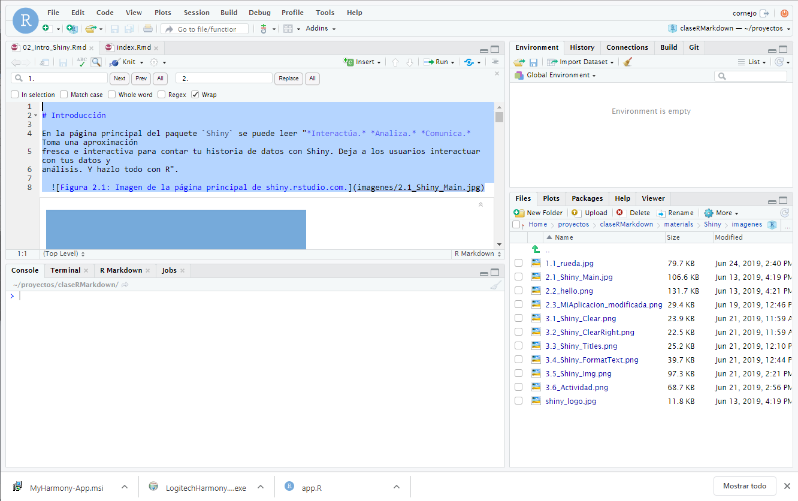

--- 
title: "Introducción a las aplicaciones web interactivas"
date: "Por definir, 2019"
site: bookdown::bookdown_site
output: bookdown::gitbook
documentclass: book
bibliography: [book.bib]
biblio-style: apalike
link-citations: yes
description: ""
always_allow_html: yes
---

# Introducción

R es es un lenguage de programación gratuito, descarga e instalación muy sencilla. Solo hay que ir al sitio [CRAN](ttp://cran.r-project.org){taget=_new} (**C**omprehensive **R** **A**rchive **N**erwork) y descargarglo. Está siponible para Windows, MacOS y Linux. 

R es un lenguaje ampliamente utilizado por la comunidad científica gracias a por su capacidad para realizar análisis estadísticos
complejos, gráficas potentes y de calidad profesional (ej. [ggplot](https://ggplot2.tidyverse.org/){target=_new}) y a la 
versatilidad para el manejo de datos, lo que en conjunto de ser una plataforma de software abierto, lo hacen especialmente 
atractivo para la ciencia de datos y a la investigación reproducible, ya que no tiene formatos privados que podrian dejar de 
ser soportados en el futuro. 

Ahora, si ud. no conoce **R**, le sugiero que cierre este curso, porque aqui se parte de la base que tiene familiaridad con R, 
puede realizar análisis, gráficos y manipulación de datos. 

## Consola R

Uno de los principales con el trabajo en R es su complejidad, lo que a vez lo hace tan flexible, y lo poco amigable de su consola de trabajo. Sin embargo, la compañía [RStudio](http://www.rstudio.com){target=_new} ha hecho disniple un excelente entorno de desarrollo integrado (IDE) que hace su uso significativamente mas simple.

## RStudio

 

RStudio (IDE para R; Figura 1.2), es un software libre con licencia GPLv3 que también puede ser ejecutado sobre distintos sistemas operativos (Windows, Mac, o Linux). 

La figura 1.2 muestra la vista típica del IDE Rstudio y sus cuatro paneles, donde se destaca en panel del editor de texto ( superior izquierdo), la consola R (panel inferior izquierdo), panel con las variables (superior derecho) y el navegador de archivos (panel inferior derecho).

