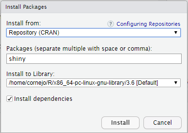
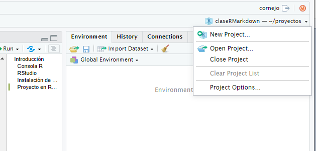
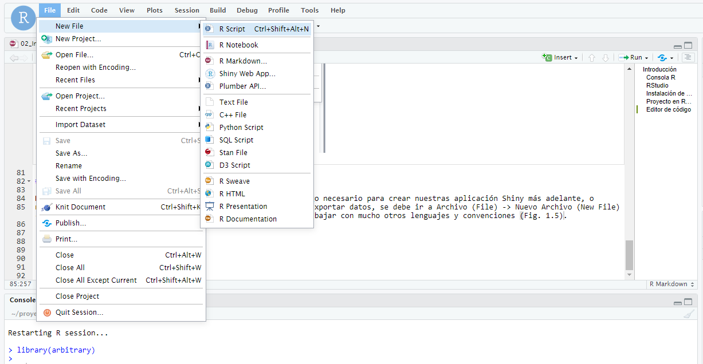

--- 
title: "Introducción a las aplicaciones web interactivas"
date: "Por definir"
site: bookdown::bookdown_site
output: bookdown::gitbook
documentclass: book
bibliography: [book.bib]
biblio-style: apalike
link-citations: yes
description: ""
always_allow_html: yes
---


# Introducción

R es es un lenguage de programación gratuito, descarga e instalación muy sencilla. Solo hay que ir al sitio
[CRAN](ttp://cran.r-project.org){taget=_new} (**C**omprehensive **R** **A**rchive **N**erwork) y descargarglo. Está disponible
para Windows, MacOS y Linux. 

R es ampliamente utilizado por la comunidad científica gracias a que nos entrega una plataforma para realizar análisis 
estadísticos complejos, gráficas potentes y de calidad profesional (ej. [ggplot](https://ggplot2.tidyverse.org/){target=_new}) y a la 
versatilidad para el manejo de datos, lo que en conjunto de ser una plataforma de software abierto, lo hacen especialmente 
atractivo para la ciencia de datos y a la investigación reproducible, ya que no tiene formatos privados que podrían dejar de 
ser soportados en el futuro. 

Ahora, si ud. no conoce **R**, le sugiero que cierre este curso y use este [libro](https://es.r4ds.hadley.nz/?fbclid=IwAR1DDPfhmrCdxkca5OqQa1D7hA5BBzzJVpKTjB62KbgtEFcxweJAmGPlKeY#) que es una excelente 
edición en espñol para aprender a usar R.

Este curso parte de la base que tiene familiaridad con R, puede realizar análisis, gráficos y manipulación de datos. 


## Consola R

```{r rueda, echo=FALSE, out.width = '80%', fig.align = 'center', fig.cap = 'Trabajar en la consola de R es como usar una rueda cuadrada..'}
knitr::include_graphics("imagenes/1.1_rueda.jpg")
```

Uno de los principales problemas para aprender a trabajar en R es su complejidad y lo poco amigable de su consola
de trabajo. Sin embargo esto es tambien su mayor virtud ya que lo hace en extremo flexible. Afortunadamente la compañía
[RStudio](http://www.rstudio.com){target=_new} ha hecho disponible un entorno de desarrollo integrado (IDE) que facilita
trabajar en R ya que tiene herramientas muy útiles para el manejo de librerías, visualización de datos, etc.

## RStudio

```{r rstudioLogo, echo=FALSE, out.width = '30%', fig.align = 'center', fig.cap = 'Logo de RStudio.'}
knitr::include_graphics("https://www.rstudio.com/wp-content/uploads/2019/03/RStudio-Logo-Blue-Gray-125.png")
```

RStudio (IDE para R; Fig. \@ref(fig:rstudioLogo)), es un software libre con licencia GPLv3 multiplataforma, lo que significa
que puede ser ejecutado en sistemas operativos Windows, Mac, o Linux. 

La figura \@ref(fig:rstudioIDE) muestra la vista típica del IDE Rstudio y sus cuatro paneles, donde se destaca en panel de 
edición de texto (superior izquierdo), la consola R (panel inferior izquierdo), panel con las variables (superior derecho) y 
el navegador de archivos (panel inferior derecho).

```{r rstudioIDE, echo=FALSE, out.width = '100%', fig.align = 'center', fig.cap = 'RStudio, IDE de R. Es la rueda que le faltaba a R para hacer el trabajo más sencillo.'}
knitr::include_graphics("imagenes/1.2_RStudio.png")
```

Entre las muchas ventajas que tiene trabajar con _RStudio_ podemos destacar:

- Permite tener en una misma ventana el código, gráficos, comandos de R, historial de comandos, variables, etc.
- Se puede trabajar con multiples archivos en forma simultanea.
- Se puede ejecutar todo el código o sólo parte de el con un click o combinación de teclas. 
- Muestra el workspace y los objetos (varibles) que contiene.
- Tiene un historial de los comando ejecutados. 
- Tiene una ayuda integrada y fácil de navegar.
- Tiene un gestor de librerías y packetes para instalar y cargar.
- Tiene un gestor de conecciones para bases de datos.
- Contiene un gestor de desarrollo de librerias o packetes de R.
- Tiene integración con [git](https://git-scm.com/){target=_new} y [GitHub](https://github.com/){target=_new}.
- Tiene un navegador de archivos.
- Provee un visor de gráficos.

## Instalación de packetes en RStudio

Para instalar un paquete o librería nueva de R se puede descargar desde CRAN utilizando la línea de comandos (como se hace en R)
o utilizando la interfase gráfica que entrega RStudio.

En el panel inferior derecho de la pantalla de Rstudio se encuentra la pestaña _Packages_, se da clic en esa pestaña y luego 
en Install, esto abre una ventana donde se pueden escribir las librerías que necesitamos. En el ejemplo en la figura
\@ref(fig:rstudioPaquetes) se va a instalar la libreria `Shiny`, que es la que usaremos en esta clase.

```{r rstudioPaquetes, echo=FALSE, out.width = '50%', fig.align = 'center', fig.cap = 'Administrador de instalación de paquetes de RStudio.'}

```

## Proyectos de RStudio

Uno de los aspectos más útiles que tiene RStudio son los _Proyectos_ (Project en inglés). Esto es un conjuto de
archivos, datos y variables, que quedan autocontenidos (en el proyecto) y hacen más fácil su administración y uso. 

Cada vez que usted inicia el trabajo en un nuevo tema, tópico o proyecto, es una muy buena práctica comenzar con la 
creación de un nuevo proyecto donde trabajará con sus archivos de código. Estos archivos con códigos son los que luego
se usan para cargar datos, crear gráficos, producir tablas, exportar datos, etc.

Un proyecto define el directorio de trabajo (equivalente a a la funcion _setwd_) relativo a donde fue creado el proyecto.
De esta forma, se puede ahorrar escribir esos path largos antes de leer/escribir cada archivo. Además, los archivos de 
código que se generen en el proyecto, estarán siempre disponibles para consultarlos en cualquier momento que el usuario
así lo desee. 

Para crear un proyecto, vamos a la pestaña superior derecha de Rstudio y damos clic en crear un proyecto (fig.
\@ref(fig:rstudioNewProject)).

```{r rstudioNewProject, echo=FALSE, out.width = '80%', fig.align = 'center', fig.cap = 'Menú desplegable para la creación de un nuevo proyecto de RStudio.'}

```

## Editor de código

Para iniciar el editor de texto, donde vamos a escribir el código de nuestra aplicación Shiny más adelante, o
realizar análisis estadísticos, crear gráficos, tablas, leer o exportar datos, se debe ir a Archivo (File) -> Nuevo Archivo
(New File) -> R Script (RScript). 

Note que en IDE RStudio se puede trabajar con muchos otros lenguajes y convenciones (Fig. \@ref(fig:rstudioNewFile)).

```{r rstudioNewFile, echo=FALSE, out.width = '100%', fig.align = 'center', fig.cap = 'Creación de un archivo nuevo en RStudio.'}

```

## Actividad

- Cree un nuevo proyecto.
- Dentro de este proyecto cree un nuevo archivo que se llame _test.R_.
- Escriba un código para definir una matriz de 4x4 con datos al azar.
- Ejecute este código línea por línea.
- Guarde estos datos en un directorio llamado datos.
- Vea donde fueron creados estos datos utilizando el explorador de archivos de RStudio.
- Revise el historial de RStudio

## Resumen

- Para crear un proyecto de RStudio abra el menu desplegable en el extremo superior derecho.
- RStudio tiene múltiples paneles con tabs que permiten ver más información de la que se ve en un principio.
- Los path son relativos de donde se crea el proyecto de RStudio.

**Nota**: Parte de esta introducción se basa en el Capitulo I del curso desarrollado por [Marco A Gonzalez](https://rstudio-pubs-static.s3.amazonaws.com/195980_3f4cd84bc3ca434daeec55c6c211d13e.html){target=_new} [@GonzalezTagle2016]
